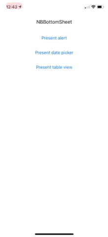

# NBBottomSheet

**NBBottomSheet** is an open-source iOS library in Swift that lets you present a bottom sheet. It works with Auto Layout to calculate the size of the bottom sheet.



## Requirements

* iOS 9.0+
* Xcode 10+
* Swift 4.2

## Installation

### CocoaPods

To integrate NBBottomSheet into your Xcode project using [CocoaPods](http://cocoapods.org), specify it in your `Podfile`:

```ruby
source 'https://github.com/CocoaPods/Specs.git'
platform :ios, '9.0'
use_frameworks!

target 'YOUR_TARGET_NAME' do
    pod 'NBBottomSheet', '~> 1.0.0'
end

```

Then, run the following command:

```bash
$ pod install
```

### Carthage

To integrate NBBottomSheet into your Xcode project using [Carthage](https://github.com/Carthage/Carthage), specify it in your `Cartfile`:

```ogdl
github "nicol3a/NBBottomSheet" ~> 1.0.0
```

### Manually

Drag the `NBBottomSheet.xcodeproj` file into your project and add the `NBBottomSheet.framework` in the *Embedded Binaries* section.

## Usage

Initialize an instance of [`NBBottomSheetController`](https://github.com/nicol3a/NBBottomSheet/blob/master/NBBottomSheet/NBBottomSheet/Sources/NBBottomSheetController.swift):

```swift
let bottomSheetController = NBBottomSheetController()
```

To display a view controller in a bottom sheet, add the following code where you want the bottom sheet to display, passing the view controller from which [`NBBottomSheetController`](https://github.com/nicol3a/NBBottomSheet/blob/master/NBBottomSheet/NBBottomSheet/Sources/NBBottomSheetController.swift) should present:

```swift
let viewController = AlertViewController()
bottomSheetController.present(viewController, on: self)
```

> **Note:** Be sure to keep a strong reference to your instance of [`NBBottomSheetController`](https://github.com/nicol3a/NBBottomSheet/blob/master/NBBottomSheet/NBBottomSheet/Sources/NBBottomSheetController.swift) for the duration of its use.

If you don’t want to use [`NBBottomSheetController`](https://github.com/nicol3a/NBBottomSheet/blob/master/NBBottomSheet/NBBottomSheet/Sources/NBBottomSheetController.swift)’s default configuration, you can specify a [`NBBottomSheetConfiguration`](https://github.com/nicol3a/NBBottomSheet/blob/master/NBBottomSheet/NBBottomSheet/Sources/NBBottomSheetConfiguration.swift) instance on initialization of [`NBBottomSheetController`](https://github.com/nicol3a/NBBottomSheet/blob/master/NBBottomSheet/NBBottomSheet/Sources/NBBottomSheetController.swift).

```swift
let configuration = NBBottomSheetConfiguration(animationDuration: 0.4)
let bottomSheetController = NBBottomSheetController(configuration: configuration)
```

### Auto Layout

The library relies on Auto Layout to calculate the size of the view controller being presented.

You can either use Storyboards or xibs to create your view controller and set the Size to *Freeform* (*Simulated Metrics* section in the *Attributes inspector* panel), or you can create your view in code.

## License

NBBottomSheet is available under the MIT license. See the [`LICENSE`](LICENSE) file for more information.

## Acknowledgements

- Created with ❤️ by [Nicolas Bichon](https://twitter.com/nicol3a)